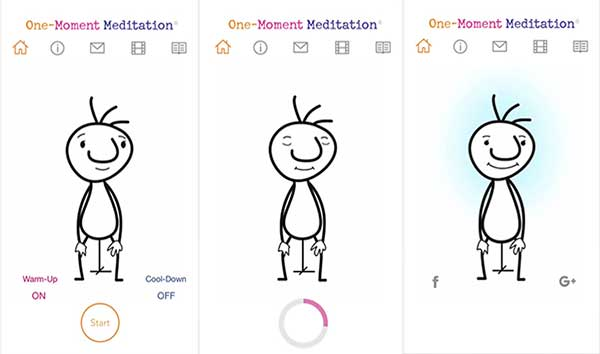
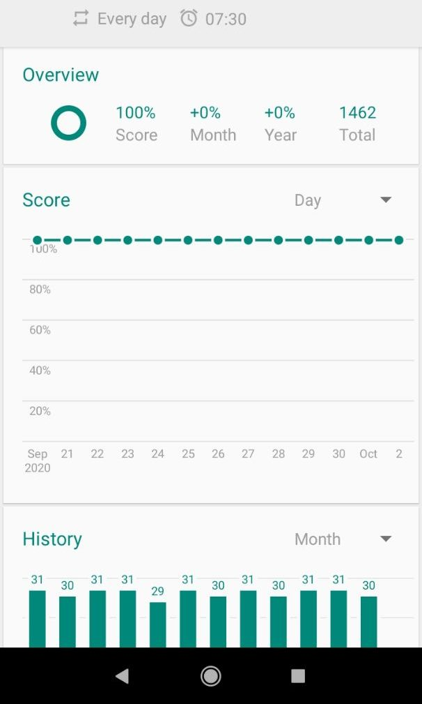
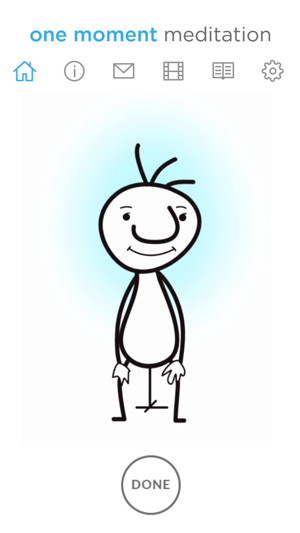

# Minimal Meditation   
Aplicativo de Meditação Minimalista para executivos e pessoas sem tempo.

### Qual é a sua ideia de aplicativo? Inclua uma breve justificativa.   
Um aplicativo Android baseado no One-Moment Meditation® que além do "Minuto-Básico" de meditação, tem uma micro-sessão de 30 segundos e uma de 3 minutos.  
( site: onemomentcompany.com/app/ e Google Play Store: play.google.com/store/apps/details?id=com.onemomentmeditation.omm1 )

### Quem usará seu aplicativo e por que eles o usarão?
Meditantes experientes e Pessoas que querem iniciar/aprender a meditar.  
Porque o limiar de entrada é mínimo e os benefícios físicos, emocionais, mentais e além são ilimitados.

   
### Existe um aplicativo similar? Se sim, como o seu será diferente?
O One-Moment MEDt citado anteriormente.  
Ele será em português inicialmente; Iremos atacar o mercado nacional e há diferenciais além de apenas o Basic-Minute ( "Minuto-Básico" ) de 1 minuto.

### Como sua aplicação será estruturada? Quais telas o usuário irá interagir, e o que elas fazem? Qual é o fluxo de navegação?
Inicia-se uma splashscreen e em seguida segue para a primeira tela da imagem.  
   
Nesta tela inicial o user pode iniciar uma sessão de "Minuto-Básico" clicando no botão Start  
ou pode clicar no menu superior para as telas de :  
* Info (explicações em TextView simples e talvez uma imagem embedded),  
* Vídeo Explicativo (youtube embedded) do próprio One-Moment expondo a referência principal,  
* Micro-Meditação de 30 segundos (clone da primeira tela mas com metade do tempo de MEDt) e  
* 3-MEDt (clone da primeira tela mas com 3 minutos de tempo de meditação).  
* Histórico de Meditação - Persistir em SQLite o número de sessões e o tempo total de meditação.
  
   
- Há um som de "ding!" ao começo e final da sessão. Serve como boundaries/balizas e ajuda a gerar mindfulness.  
- Uso de animação visual de um cronometro radial regressivo assim que o user iniciar uma sessão.  
(com click listener na animação para dar Stop na sessão de meditação.)  

## Tela com GRÁFICOS
Além da tela base de meditação para o Basic-Minute e escolha das outras 2 meditações;  
Haverá 1 tela com gráficos de consistência do hábito e log de cada meditação com geolocalização e potencialmente mais anexos como foto do local.  

###### Mock-up:  

___

PS - Ao fluir do desenvolvimento com bom desempenho pretendo acrescer as funcionalidades de :
* notificação para sugestão diária da prática meditativa,  
* evoluir de um design cru e feio para um "clear", minimalista e appealing/atraente (eye-candy),  
* animação/s progressiva ao passar da sessão.  

---

**_QI_Solutions, LLC_**
