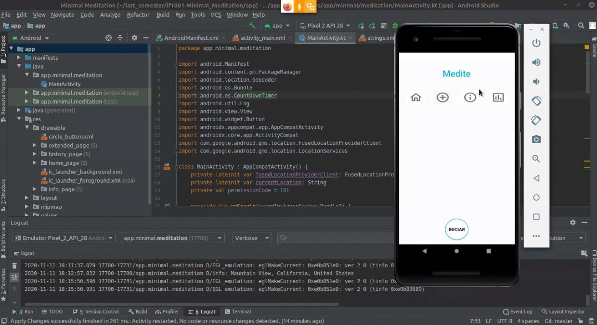

# Minimal Meditation   
Aplicativo de Meditação Minimalista para executivos e pessoas sem tempo.

### Status Report em 13/11/2020
Init do desenvolvimento via um projeto Android novo do zero com preset _blank activity_.  
Início do dev baseando-se no fundo branco, cores e design do O.M.M. (One-Moment Meditation®).  
Add Buttons, sem click listener ainda.  
Countdown funcionando inverso (progressivo e não regressivo); Também sem a animação proposta (é _minor_ em comparação com o que precisa ser feito ainda).  
Foi iniciado o dev da localização grossa (não _fine location_), baseado na própria documentação e exemplos de Android.  Geocode pegando apenas cidade a princípio.  
  

### Moving Foward para semana que vem _20/11/2020_
Dev outras 2 meditações com tempos diferentes.  
Dar início ao dev do statistics/analytics/gráficos do App.  
Iremos também continuar o refinamento do App em função da especificação porém com menos afinco. O foco é a engenharia e não o design.  

###### Screenshot do Dev:  

---

**_Solution-First, LLC_**
